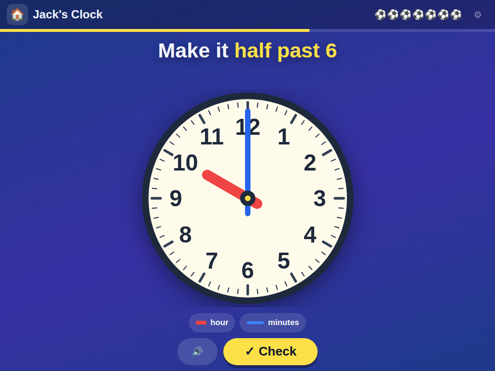

# ⏰ Jack's Clock

**Learning to tell the time on a real clock face — o'clock, half past, quarter past and quarter to**

[](https://jacks-games.github.io/clock/)




## What this is

A clock with a face and two hands, the way it is taught in Year 1 and Year 2: first read it,
then set it yourself. Forty clocks in six steps, always in this order:

|   | Step | What happens |
|---|---|---|
| 1️⃣ | **Read o'clock** | The clock shows 3 o'clock — pick the right one of three tiles |
| 2️⃣ | **Set o'clock** | "Make it 4 o'clock" — drag the hands, then tap ✓ |
| 3️⃣ | **Read half past** | The short hand sits half way between two numbers |
| 4️⃣ | **Set half past** | "Make it half past 2" |
| 5️⃣ | **Read the quarters** | Quarter past and quarter to, with the face split into *past* and *to* |
| 6️⃣ | **Set them all** | O'clock, half past and the quarters mixed |

## 🎮 How to play

### 1️⃣ &nbsp; Read the clock 👀
Three tiles, one right. The two wrong ones are the mistakes children really make:
**half past read one hour on** (at half past three the short hand is already close to the
four), **past and to swapped**, and **the long hand read as the hour**. A wrong tap wobbles the
tile and greys it out — there is no way to lose. Tap any number on the face to hear it.

### 2️⃣ &nbsp; Set the clock ✋
The **short red hand** shows the hour, the **long blue hand** the minutes. Both can be
dragged with a finger, and they are geared like a real clock: turn the long hand once round
past the twelve and the short hand moves on by an hour. The long hand stops on the quarters,
and when a hand is let go the clock says what it shows now — *"quarter to four"*.

**✓ Check** gives a spoken hint about the hand that is wrong and makes that hand blink:
*"For half past, the long hand points to six."* or *"The short hand is just before four."*
After three tries the hands turn to the right time by themselves and it is on to the next.

### ⚽ &nbsp; Goal!
A right answer pays a football, shows the time in rainbow letters next to the digital time,
and explains the picture: *"Half past three! The long hand points to six. The short hand is
half way between three and four. It is half past three."* Five right in a row: **On fire! 🔥**

### 🏁 &nbsp; Full time
After the fortieth clock the whistle goes. Progress is kept on the device; ⚙ jumps straight to
any of the six steps.

## 🎯 What it practises

- 🕐 &nbsp; **Which hand is which** — short for the hour, long for the minutes
- 🕧 &nbsp; **Where the short hand really is** — on the number only at o'clock, half way at half past, just after or just before at the quarters
- ↔️ &nbsp; **Past and to** — the right half of the clock is *past*, the left half is *to*
- 👂 &nbsp; **The words** — every one of the 48 quarter-hour times is spoken

## 🗣 The voice

Every line is a **pre-rendered clip** of Microsoft's neural `en-GB-SoniaNeural` voice — 206 of
them: each question, hint and answer, and all 48 times from *twelve o'clock* to *quarter to
twelve*. The browser's own speech synthesis is only the fallback for a line with no clip.

Everything the game can say is built in one block of `index.html` marked `TEXT-CORE`, and the
phrase list the clips are rendered from is generated straight out of that block — so a new
clock can never end up with no voice.

## 🎈 The other games

| Game | What it is | |
|---|---|---|
| 🔟 [**Jack's Ten Frames**](https://github.com/jacks-games/ten-frames) | See numbers in fives, make ten, then add past ten on ten frames | [▶ play](https://jacks-games.github.io/ten-frames/) |
| ⏰ [**Jack's Clock**](https://github.com/jacks-games/clock) | Read the clock and set the hands — o'clock, half past, quarter past, quarter to | [▶ play](https://jacks-games.github.io/clock/)  👈 **this one** |
| 💯 [**Jack's Big Numbers**](https://github.com/jacks-games/big-numbers) | Tens and ones, adding and taking away all the way to 100 | [▶ play](https://jacks-games.github.io/big-numbers/) |
| 👀 [**Jack's Sight Words**](https://github.com/jacks-games/sight-words) | The twenty most common English words on big cards — tap one and hear it read out | [▶ play](https://jacks-games.github.io/sight-words/) |
| 🍎 [**Jack's Apples**](https://github.com/jacks-games/apples) | Trace 1–20, then fill the missing numbers into the apple grid | [▶ play](https://jacks-games.github.io/apples/) |
| 🥅 [**Jack's Match**](https://github.com/jacks-games/match) | Tell real words from decodable nonsense words, then spell by ear | [▶ play](https://jacks-games.github.io/match/) |
| ✏️ [**Jack's Letters**](https://github.com/jacks-games/letters) | Finger-trace all 26 lowercase letters in the correct stroke order | [▶ play](https://jacks-games.github.io/letters/) |
| 🔢 [**Jack's Numbers**](https://github.com/jacks-games/numbers) | Count, add and subtract with footballs — to 10, then to 20 | [▶ play](https://jacks-games.github.io/numbers/) |
| 📖 [**Jack's Words**](https://github.com/jacks-games/words) | Hear a word, build it from letter tiles, then read it in a sentence | [▶ play](https://jacks-games.github.io/words/) |
| ♟️ [**Jackies Schach**](https://github.com/jacks-games/chess) | Full FIDE rules with a coach that marks the safe squares (German) | [▶ play](https://jacks-games.github.io/chess/) |

All ten on one start page: **[jackbenn.ing](https://jackbenn.ing)** — newest first, homework on top, chess always last.

## 🛠 Built like this

Every game in this organisation is **one self-contained `index.html`** — no build step, no
framework, no package manager, no analytics, and no network calls beyond its own voice clips (chess also loads its rules engine, chess.js, from
jsDelivr, and Sight Words its font from Google Fonts).
That is a deliberate constraint: a game a child depends on should still work in five years,
and a parent should be able to read the whole thing in one sitting.

- **Speech** — pre-rendered clips of the neural `en-GB-SoniaNeural` voice, played through Web Audio,
  with the Web Speech API as the fallback. The `AudioContext` is created inside the ▶ tap,
  because iOS refuses to start audio any other way.
- **Progress** — kept in `localStorage` on the device (`jackClockIndex`, `jackClockFootballs`).
  Nothing is collected, sent or stored anywhere else.
- **Made for** an iPad mini in either orientation and a phone: the clock grows and shrinks to
  the space it has, so the tiles and the ✓ are never pushed out of reach and the page never
  scrolls. Finger-sized targets, no hover-only interactions, `prefers-reduced-motion`
  respected.

Run it locally:

```bash
python3 -m http.server 8000
```

The start page at [jackbenn.ing](https://jackbenn.ing) is built from
[google814/Jack](https://github.com/google814/Jack), which is the source of truth. The repos
in this organisation are copies kept in step by `tools/sync-game-repos.sh` in that repo, so
each game also has its own page and its own link.
